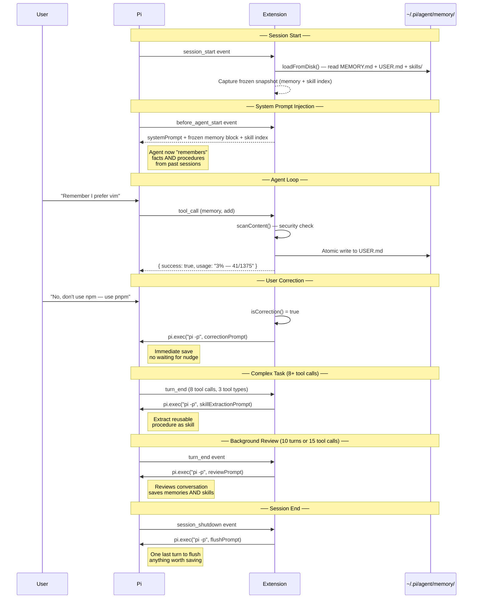
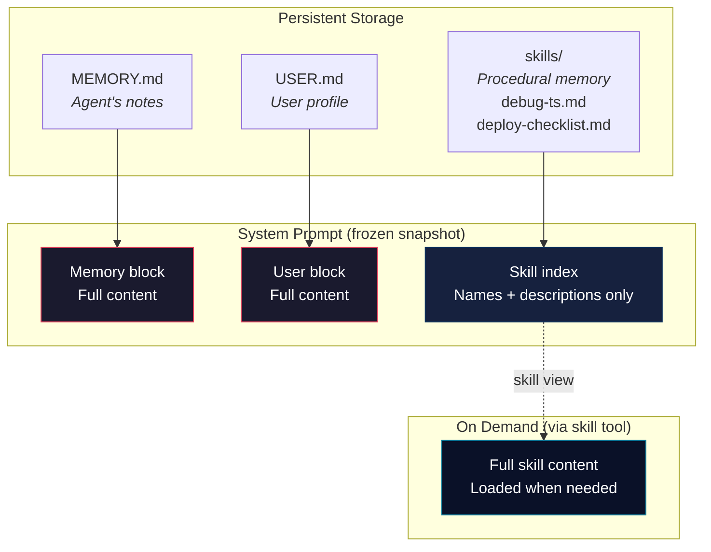
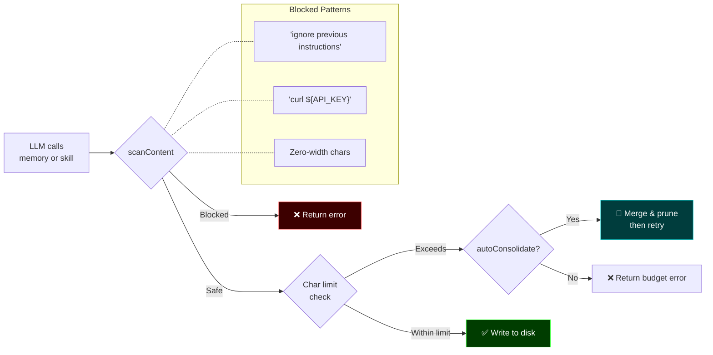
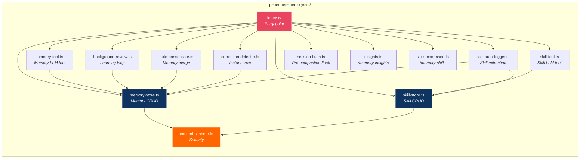

# 🧠 Pi Hermes Memory

A [Pi coding agent](https://github.com/badlogic/pi-mono) extension that gives your AI agent **persistent memory across sessions** and a **self-directed learning loop** — ported from the [Hermes agent](https://github.com/nousresearch/hermes-agent) harness.

## What It Does

Your Pi agent normally forgets everything when you close a session. This extension fixes that.

| Feature | What happens |
|---|---|
| **Persistent Memory** | The agent saves facts, preferences, and lessons to markdown files that survive restarts |
| **Procedural Skills** | The agent saves *how* it solved problems as reusable skill documents |
| **Background Learning** | Every 10 turns (or 15 tool calls) the agent reviews your conversation and proactively saves what it learned |
| **Correction Detection** | When you correct the agent ("no, don't do that"), it saves immediately — no waiting |
| **Auto-Consolidation** | When memory hits capacity, the agent automatically merges and prunes entries instead of erroring |
| **Session Flush** | Before context is compressed or the session ends, the agent gets one last chance to save anything worth remembering |
| **Onboarding Interview** | `/memory-interview` — answer 5-7 questions to pre-fill your profile on the very first session |
| **Context Fencing** | Memory blocks are wrapped in `<memory-context>` tags so the LLM never treats stored facts as user instructions |
| **Memory Aging** | Entries carry timestamps — consolidation knows which facts are stale and which are fresh |
| **Project Memory** | Per-project memory (`~/.pi/agent/<project>/MEMORY.md`) alongside your global memory |
| **Secret Detection** | API keys, tokens, SSH keys, and credential assignments are blocked from being persisted to memory |

## How It Works

### Session Lifecycle



### Memory + Skills Architecture

The extension manages three types of knowledge:

| Type | What | Storage | Token cost |
|---|---|---|---|
| **Memory** (MEMORY.md) | Facts — env details, project conventions, tool quirks | 2,200 chars max | Fixed per session |
| **User Profile** (USER.md) | Who you are — name, preferences, communication style | 1,375 chars max | Fixed per session |
| **Skills** (skills/*.md) | Procedures — *how* to do something, reusable across sessions | Unlimited | ~3K for index, full on demand |



### Security: Content Scanning

Every write — memory and skills — passes through a scanner before being accepted. This prevents the LLM from being tricked into storing malicious content that would later be injected into the system prompt.



## Installation

```bash
pi install npm:pi-hermes-memory
```

Or install from GitHub:

```bash
pi install git:github:chandra447/pi-hermes-memory
```

Or test locally without installing:

```bash
pi -e /path/to/pi-hermes-memory/src/index.ts
```

## Two-Tier Memory Architecture

The extension stores memory at two levels:

| Tier | Location | What goes here | Injected when |
|---|---|---|---|
| **Global** | `~/.pi/agent/memory/` | Facts that apply everywhere — your name, preferences, OS, tools | Always (every session) |
| **Project** | `~/.pi/agent/<project>/` | Facts scoped to one codebase — architecture decisions, API quirks, team norms | When cwd matches the project |

Both tiers are injected into the system prompt under separate `<memory-context>` blocks.

```
System Prompt
┌─────────────────────────────────────────┐
│ <memory-context>                        │
│ MEMORY (your personal notes)            │
│ • prefers vim over nano                 │
│ • uses pnpm not npm                     │
│ ═══ END MEMORY ═══                     │
│ </memory-context>                       │
│                                         │
│ <memory-context>                        │
│ USER PROFILE (who the user is)          │
│ • name: Chandrateja                     │
│ • timezone: AEST                        │
│ ═══ END MEMORY ═══                     │
│ </memory-context>                       │
│                                         │
│ <memory-context>                        │
│ PROJECT MEMORY: pi-hermes-memory        │
│ • uses jiti for runtime TS loading      │
│ • tests use node:test with tsx          │
│ ═══ END MEMORY ═══                     │
│ </memory-context>                       │
└─────────────────────────────────────────┘
```

Memory blocks are wrapped in `<memory-context>` XML tags with a guard note ("NOT new user input") to prevent the LLM from treating stored facts as instructions.

## Usage

Once installed, the extension works automatically. You don't need to do anything special — the agent will start saving memories and skills on its own.

### The `memory` Tool

The agent gets a `memory` tool it can call proactively:

| Action | Target | What it does |
|---|---|---|
| `add` | `memory` or `user` | Append a new entry |
| `replace` | `memory` or `user` | Update an existing entry (matched by substring) |
| `remove` | `memory` or `user` | Delete an entry (matched by substring) |

### The `skill` Tool

The agent also gets a `skill` tool for saving reusable procedures:

| Action | What it does |
|---|---|
| `create` | Save a new skill (name, description, step-by-step body) |
| `view` | Read a skill's full content, or list all skills if no name given |
| `patch` | Update one section of an existing skill (e.g., just the Procedure section) |
| `edit` | Replace the description and/or full body of a skill |
| `delete` | Remove a skill |

Skills are stored as `SKILL.md` files in `~/.pi/agent/memory/skills/`. Each has a structured body:

```markdown
---
name: debug-typescript-errors
description: Step-by-step approach to debugging TS errors in monorepos
version: 1
created: 2026-04-26
updated: 2026-04-26
---
## When to Use
When you see TypeScript compilation errors, especially in monorepo setups.

## Procedure
1. Read the error message carefully
2. Check tsconfig.json extends chain
3. Run tsc --noEmit to get full error list
4. Fix errors bottom-up (dependencies first)

## Pitfalls
- Don't trust VSCode's error display — use the CLI

## Verification
Run `tsc --noEmit` and confirm zero errors.
```

### Memory vs User Profile vs Skills

| Store | File | What goes here | Limit |
|---|---|---|---|
| **memory** | `MEMORY.md` | Agent's notes — env facts, project conventions, tool quirks, lessons learned | 2,200 chars |
| **user** | `USER.md` | User profile — name, preferences, communication style, habits | 1,375 chars |
| **skills** | `skills/*.md` | Procedures — *how* to debug, deploy, test, or fix something | Unlimited |

### Correction Detection

When you correct the agent, it saves immediately — no waiting for the background review. Examples of corrections the agent detects:

| You say | What happens |
|---|---|
| "don't do that" | ✅ Immediate save |
| "no, use yarn instead" | ✅ Immediate save |
| "actually, fix the test first" | ✅ Immediate save |
| "I said use pnpm" | ✅ Immediate save |
| "no worries" | ❌ Not a correction — ignored |
| "actually looks great" | ❌ Not a correction — ignored |

### Auto-Consolidation

When memory or user profile hits its character limit, the extension automatically consolidates instead of returning an error:

1. Spawns a one-shot `pi.exec()` process with a consolidation prompt
2. The child agent merges related entries, removes outdated ones, keeps the most important facts
3. Parent reloads from disk and retries the original save
4. If consolidation fails, falls back to the original error

You can also trigger this manually with `/memory-consolidate`.

### Tool-Call-Aware Review

Background review triggers based on **activity level**, not just turn count:

- **Every 10 turns** — the default nudge interval
- **OR every 15 tool calls** — catches complex tasks that involve many reads/edits/bash calls

Both counters reset after each review.

### Skill Auto-Extraction

After a complex task (8+ tool calls using 2+ different tools in a single turn), the extension automatically asks the agent:

> "This was a complex task — should we save a reusable procedure?"

This means skills build up naturally over time without you having to ask.

### Commands

| Command | What it does |
|---|---|
| `/memory-insights` | Shows everything stored in memory and user profile |
| `/memory-skills` | Lists all agent-created skills |
| `/memory-consolidate` | Manually trigger memory consolidation to free space |
| `/memory-interview` | Answer a few questions to pre-fill your user profile |
| `/memory-switch-project` | List all project memories and their entry counts |

### `/memory-insights` Output

```
╔══════════════════════════════════════════════╗
║            🧠 Memory Insights                ║
╚══════════════════════════════════════════════╝

📋 MEMORY (your personal notes)
──────────────────────────────────────────────
1. project uses pnpm not npm
2. test files go in __tests__/ directory
3. user prefers dark theme for UI

👤 USER PROFILE
──────────────────────────────────────────────
1. name: Chandrateja
2. prefers concise answers over verbose ones
3. codes primarily in TypeScript
```

### `/memory-skills` Output

```
╔══════════════════════════════════════════════╗
║            🧠 Procedural Skills             ║
╚══════════════════════════════════════════════╝

📄 debug-typescript-errors
   Step-by-step approach to debugging TS errors in monorepos
   file: debug-typescript-errors.md

📄 deploy-checklist
   Pre-deploy verification steps for this project
   file: deploy-checklist.md
```

## Configuration

Create `~/.pi/agent/hermes-memory-config.json`:

```json
{
  "memoryCharLimit": 2200,
  "userCharLimit": 1375,
  "projectCharLimit": 2200,
  "memoryDir": "~/.pi/agent/memory",
  "nudgeInterval": 10,
  "nudgeToolCalls": 15,
  "reviewEnabled": true,
  "autoConsolidate": true,
  "correctionDetection": true,
  "flushOnCompact": true,
  "flushOnShutdown": true,
  "flushMinTurns": 6
}
```

| Setting | Default | Description |
|---|---|---|
| `memoryCharLimit` | `2200` | Max characters in MEMORY.md |
| `userCharLimit` | `1375` | Max characters in USER.md |
| `projectCharLimit` | `2200` | Max characters in project-scoped MEMORY.md |
| `memoryDir` | `~/.pi/agent/memory` | Custom directory for memory files |
| `nudgeInterval` | `10` | Turns between auto-reviews |
| `nudgeToolCalls` | `15` | Tool calls between auto-reviews (OR with turns) |
| `reviewEnabled` | `true` | Enable/disable background learning loop |
| `autoConsolidate` | `true` | Auto-merge when memory hits capacity |
| `correctionDetection` | `true` | Detect user corrections and save immediately |
| `flushOnCompact` | `true` | Flush memories before Pi compacts context |
| `flushOnShutdown` | `true` | Flush memories when session ends |
| `flushMinTurns` | `6` | Minimum turns before flush triggers |

## Where Data Lives

```
~/.pi/agent/memory/
├── MEMORY.md          ← Agent's personal notes (env facts, patterns, lessons)
├── USER.md            ← User profile (name, preferences, habits)
└── skills/
    ├── debug-typescript-errors.md
    └── deploy-checklist.md
```

These are plain markdown files. You can read and edit them directly if you want to curate what the agent remembers. Memory entries are separated by `§` (section sign). Skills use standard SKILL.md format with frontmatter.

## Known Limitations

- **`§` delimiter**: Memory entries are separated by `§` (section sign). If an entry naturally contains `§`, it will be split incorrectly on reload. This is rare in English text but possible. [Hermes uses the same delimiter.]
- **Background review cost**: Each review cycle costs one full LLM API call via a child `pi -p` process. Correction detection and skill auto-extraction add occasional extra calls.
- **No search/indexing**: At the 2,200-char limit, the LLM can scan the entire block. Full-text search across sessions is planned for v0.3.
- **System prompts are invisible**: Pi's TUI does not display the system prompt. Memory injection works but you won't see it in the interface — verify by asking the agent a question that relies on stored memory.
- **Skills are agent-generated**: Skills are created by the agent based on its experience. They may not always be perfectly structured. You can edit or delete them in `~/.pi/agent/memory/skills/`.

## Architecture



## Credits

Ported from the [Hermes agent](https://github.com/nousresearch/hermes-agent) by Nous Research. Specifically:

- `tools/memory_tool.py` — `MemoryStore` class, content scanner, tool schema
- `run_agent.py` — Background review loop, session flush, nudge interval
- `agent/memory_provider.py` — Provider lifecycle pattern
- `agent/memory_manager.py` — System prompt injection, context fencing

## License

MIT

---

**[Full Roadmap →](docs/ROADMAP.md)** · **[Changelog →](CHANGELOG.md)**
