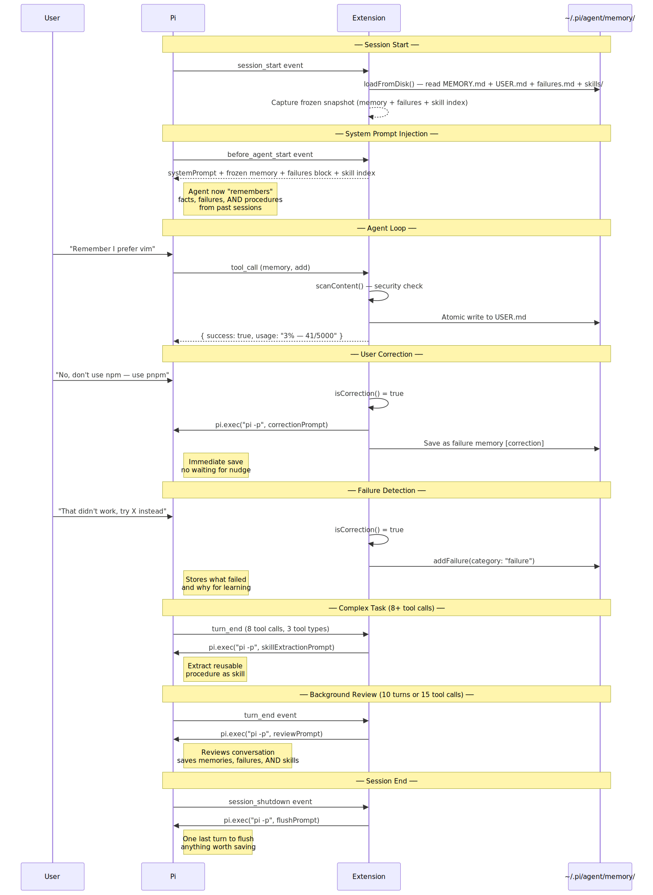

<div align="center">


# 🧠 Pi Hermes Memory

**Persistent memory + session search + reviewed skill creation for Pi**

---

</div>

Your Pi agent normally forgets everything when you close a session. **This extension fixes that** — and in v0.7 it adds a safe reviewed pipeline for turning repeated patterns from session history into reusable skills, while keeping the earlier auto-skill nudges available for complex tasks.

- 🔍 **Search every conversation** — `session_search` finds prior discussions fast
- 🧠 **Persistent memory** — facts, preferences, corrections survive across sessions
- ⚠️ **Learns from failures** — remembers what did not work so you do not repeat it
- 🏷️ **Candidate review pipeline** — repeated patterns become reviewable candidates first
- 📚 **Reviewed skill creation** — approved candidates can be promoted into skills with explicit confirmation
- 🤖 **Auto-skill nudges still exist** — complex tasks can still trigger skill extraction prompts
- 🛡️ **Secret scanning** — API keys and tokens are blocked from being saved
- 🔄 **Safe rebuild + observability** — rebuild candidates from session truth and inspect counts

## Quick Start

```bash
# Install
pi install npm:pi-hermes-memory

# Index your past sessions (one-time)
/memory-index-sessions

# Build the candidate queue from indexed session messages
/memory-candidates-rebuild

# Review extracted candidates
/memory-review-candidates

# Learn the workflow
/learn-memory-tool
```

## What v0.7 Adds

v0.7 introduces a **session → candidate → review → skill** workflow:

1. **Index sessions** into SQLite with `/memory-index-sessions`
2. **Extract candidate learnings** from repeated corrections, failure/fix pairs, and repeated successful tool sequences
3. **Review candidates in TUI** with `/memory-review-candidates`
4. **Approve / reject / edit / merge** candidates before promotion
5. **Promote approved candidates** into a structured skill draft
6. **Confirm explicitly** before the skill is saved and candidates are marked promoted

This keeps the candidate-based path intentional. The extension can stage patterns into candidates via rebuild/shadow commands, and reviewed promotion requires explicit confirmation. Separately, the older auto-skill path for complex tasks still exists.

## Features

| Feature | What happens |
|---|---|
| 🔍 **Session Search** | Search past conversations via SQLite FTS5 |
| 🧠 **Persistent Memory** | Facts, preferences, lessons saved to markdown files |
| ⚠️ **Failure Memory** | Learn from failures — stores what did not work and why |
| 🏷️ **Candidate Pipeline** | Deterministic extractors stage reviewable candidates |
| 🧪 **TUI Review Flow** | Approve / reject / edit / merge / promote candidates in `/memory-review-candidates` |
| 📚 **Reviewed Skills** | Approved candidates become draft skills with explicit confirmation |
| 🤖 **Auto-Skill Nudge** | Complex tasks can still trigger the earlier skill extraction prompt |
| 📈 **Candidate Observability** | `/memory-candidates-stats` shows pending / approved / rejected / promoted counts |
| ♻️ **Safe Candidate Rebuild** | `/memory-candidates-rebuild` regenerates candidates from indexed session truth |
| 🛡️ **Secret Scanning** | API keys, tokens, SSH keys blocked from persistence |
| 🔧 **Correction Detection** | When you correct the agent, it saves immediately |
| 🔄 **Auto-Consolidation** | When memory hits capacity, auto-merges instead of erroring |
| 🏗️ **Two-Tier Memory** | Global + per-project memory, both searchable |

## How It Works

### Session Lifecycle



### Memory + Candidate + Skill Architecture

The extension now manages four layers of knowledge:

| Type | What | Storage | Token cost |
|---|---|---|---|
| **Memory** | Facts — env details, project conventions, tool quirks | `MEMORY.md` | Fixed per session |
| **User Profile** | Who you are — name, preferences, communication style | `USER.md` | Fixed per session |
| **Candidates** | Review queue of repeated patterns from session history | `memory_candidates` in SQLite | Not injected |
| **Skills** | Procedures — reusable operational playbooks | `skills/*.md` | Index injected, full content on demand |



### Security: Content Scanning

Memory writes and skill persistence pass through a scanner before being accepted. This blocks malicious prompt-injection or secret-like content from being persisted in those stores.



## Candidate Review Workflow (v0.7)

### 1. Index session history

```bash
/memory-index-sessions
```

This imports Pi session JSONL into SQLite so the extractor can work from indexed session messages.

### 2. Inspect extraction quality safely

```bash
/memory-candidates-shadow-run
```

Shadow mode runs the extractor in **read-only** mode so you can inspect quality before writing candidates.

### 3. Rebuild candidates from indexed sessions

```bash
/memory-candidates-rebuild
```

This clears the current candidate projection and rebuilds it from indexed SQLite session messages using deterministic rules. Rebuild is transactional — if extraction fails, existing candidates are restored.

### 4. Review candidates in TUI

```bash
/memory-review-candidates
```

Available actions:
- approve
- reject
- edit
- merge
- promote

### 5. Promote approved candidates into a skill draft

Promotion is gated by:
- all selected candidates must be **approved**
- at least one selected approved candidate must have **`evidence_count >= 2`**
- explicit **final confirmation** before skill creation

The generated draft includes:
- `## When to Use`
- `## Procedure`
- `## Pitfalls`
- `## Verification`

### 6. Inspect pipeline counts

```bash
/memory-candidates-stats
```

Shows:
- pending
- approved
- rejected
- promoted
- total

## Installation

```bash
pi install npm:pi-hermes-memory
```

Or install from GitHub:

```bash
pi install git:github:chandra447/pi-hermes-memory
```

Or test locally without installing:

```bash
pi -e /path/to/pi-hermes-memory/src/index.ts
```

## Usage

### Automatic behavior

Once installed, the extension automatically:
- injects saved memory, user profile, recent failures, and skill index into the system prompt
- detects corrections and failures
- runs background review on active sessions
- indexes sessions for later search

### Intentional review flow

For v0.7 candidate promotion, the recommended workflow is:

1. `/memory-index-sessions`
2. optional `/memory-candidates-shadow-run`
3. `/memory-candidates-rebuild`
4. `/memory-review-candidates`
5. `/memory-candidates-stats`

### The `memory` Tool

| Action | Target | What it does |
|---|---|---|
| `add` | `memory`, `user`, `failure`, `project` | Append a new entry |
| `replace` | `memory`, `user`, `failure`, `project` | Update an existing entry |
| `remove` | `memory`, `user`, `failure`, `project` | Delete an existing entry |

### The `skill` Tool

| Action | What it does |
|---|---|
| `create` | Save a new skill |
| `view` | Read a skill's full content |
| `patch` | Update one section of an existing skill |
| `edit` | Replace the description and/or body |
| `delete` | Remove a skill |

Skills are stored in `~/.pi/agent/memory/skills/` as markdown files with frontmatter and required sections.

### Commands

| Command | What it does |
|---|---|
| `/memory-insights` | Shows everything stored in memory and user profile |
| `/memory-skills` | Lists all saved skills |
| `/memory-consolidate` | Manually trigger memory consolidation |
| `/memory-interview` | Pre-fill your user profile |
| `/memory-switch-project` | List project memories |
| `/memory-index-sessions` | Import past Pi sessions into the search database |
| `/memory-candidates-shadow-run` | Run read-only candidate extraction report |
| `/memory-review-candidates` | Review / triage / promote extracted candidates |
| `/memory-candidates-stats` | Show candidate pipeline counts |
| `/memory-candidates-rebuild` | Rebuild candidate projection from indexed sessions |
| `/learn-memory-tool` | Built-in guide for the memory + candidate workflow |

## Configuration

Create `~/.pi/agent/hermes-memory-config.json`:

```json
{
  "memoryCharLimit": 5000,
  "userCharLimit": 5000,
  "projectCharLimit": 5000,
  "memoryDir": "~/.pi/agent/memory",
  "nudgeInterval": 10,
  "nudgeToolCalls": 15,
  "reviewEnabled": true,
  "autoConsolidate": true,
  "correctionDetection": true,
  "flushOnCompact": true,
  "flushOnShutdown": true,
  "flushMinTurns": 6,
  "candidateShadowMode": true,
  "candidateConfidenceThreshold": 0.75
}
```

| Setting | Default | Description |
|---|---|---|
| `memoryCharLimit` | `5000` | Max characters in `MEMORY.md` |
| `userCharLimit` | `5000` | Max characters in `USER.md` |
| `projectCharLimit` | `5000` | Max characters in project-scoped memory |
| `memoryDir` | `~/.pi/agent/memory` | Custom directory for memory files |
| `nudgeInterval` | `10` | Turns between auto-reviews |
| `nudgeToolCalls` | `15` | Tool calls between auto-reviews |
| `reviewEnabled` | `true` | Enable background learning loop |
| `autoConsolidate` | `true` | Auto-merge when memory hits capacity |
| `correctionDetection` | `true` | Detect user corrections and save immediately |
| `flushOnCompact` | `true` | Flush memories before Pi compacts context |
| `flushOnShutdown` | `true` | Flush memories when session ends |
| `flushMinTurns` | `6` | Minimum turns before flush triggers |
| `candidateShadowMode` | `true` | Enable read-only candidate extraction reporting |
| `candidateConfidenceThreshold` | `0.75` | Minimum confidence accepted during candidate rebuild |

## Where Data Lives

```text
~/.pi/agent/memory/
├── MEMORY.md
├── USER.md
├── failures.md
├── sessions.db
└── skills/
    └── *.md
```

Candidate rows live in the SQLite `memory_candidates` table inside `sessions.db`. They are a rebuildable projection derived from indexed session messages.

## Known Limitations

- **`§` delimiter**: core markdown memory files still use `§` as the entry delimiter
- **Background review cost**: each review cycle uses a child `pi -p` call
- **Session search requires indexing**: bulk-import old sessions with `/memory-index-sessions`
- **Candidates are a projection**: indexed SQLite session messages are the source for rebuilds; candidates can be regenerated from them
- **Skill drafts still need human judgment**: the candidate-review path generates structured drafts, but review quality still matters
- **Two skill paths exist today**: reviewed candidate promotion and the earlier auto-skill prompt for complex tasks

## Architecture



## Credits

Ported from the [Hermes agent](https://github.com/nousresearch/hermes-agent) by Nous Research, then extended for Pi with persistent memory, SQLite-backed search, and reviewed skill creation.

## License

MIT

---

**[Full Roadmap →](docs/ROADMAP.md)** · **[v0.7 Changelog →](docs/0.7/CHANGELOG.md)**
