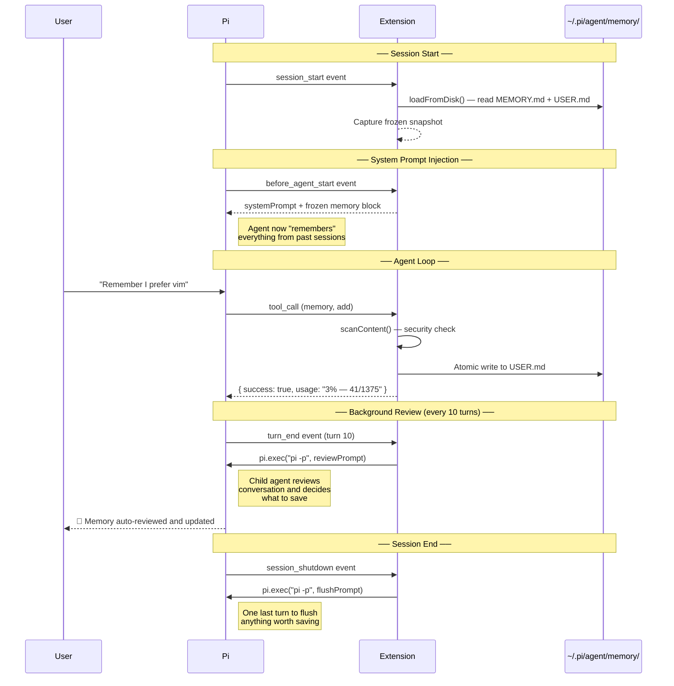
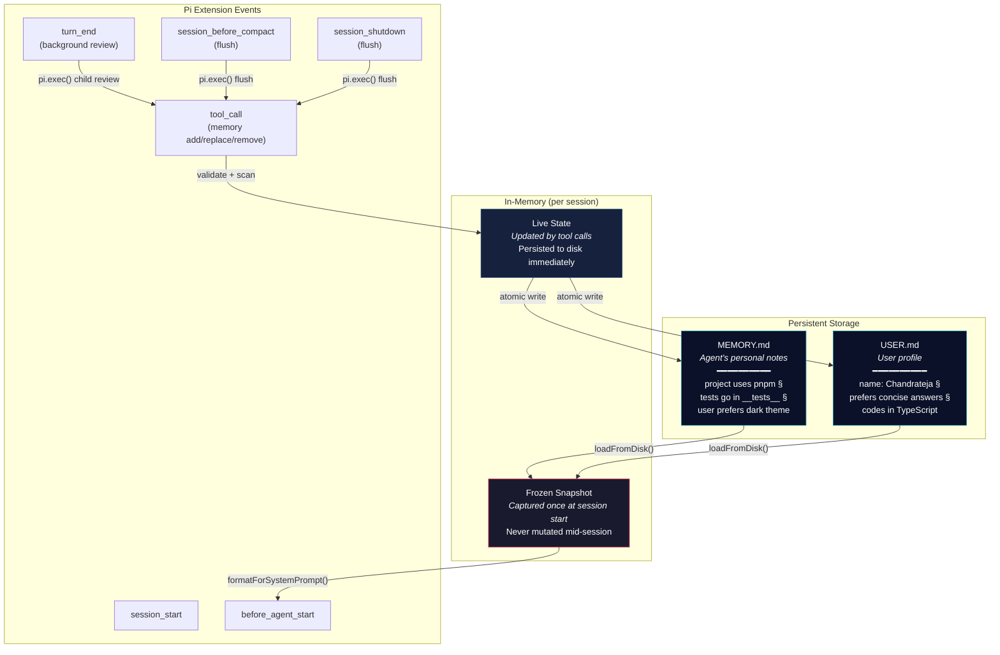
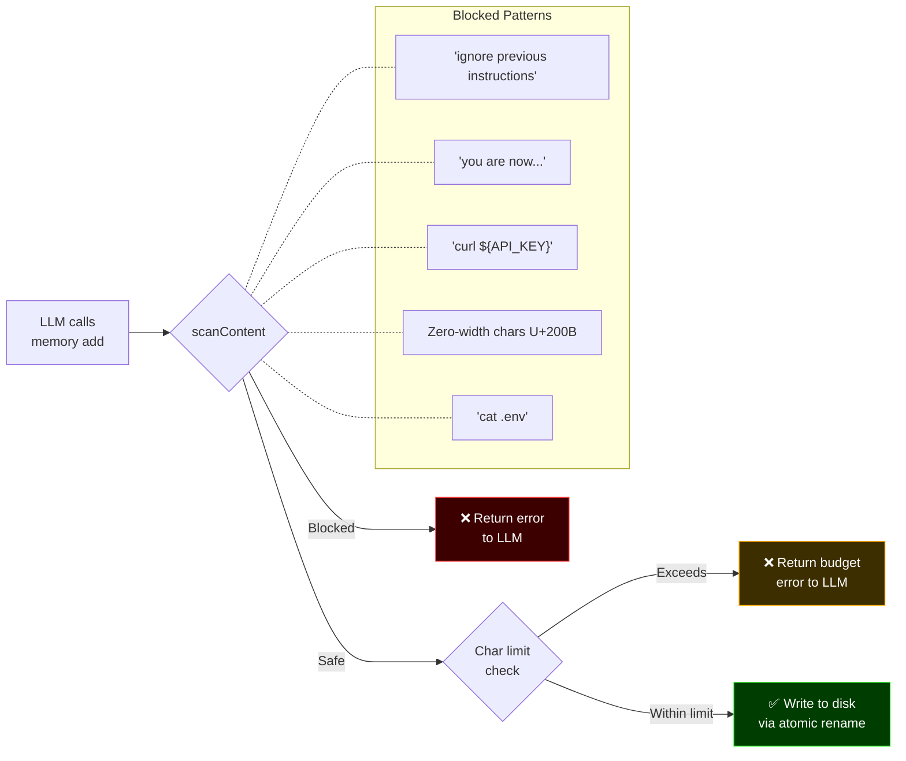
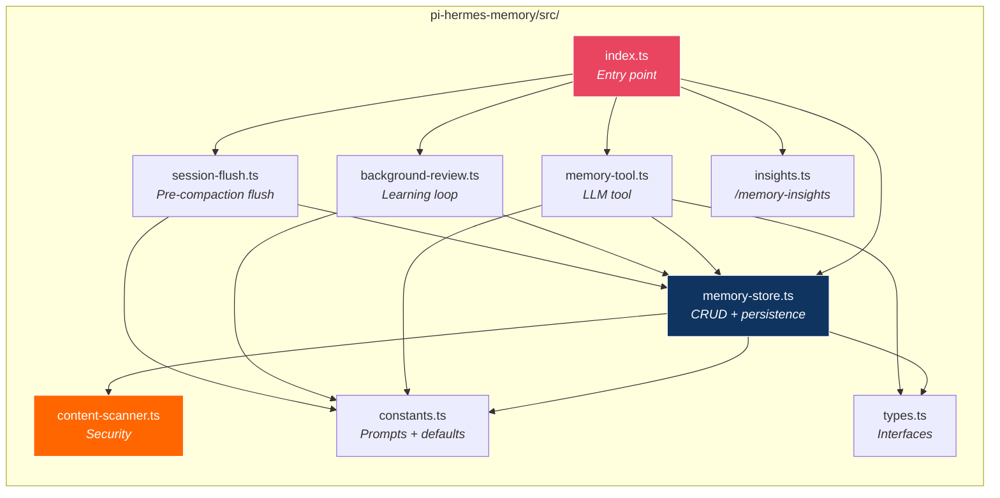

# 🧠 Pi Hermes Memory

A [Pi coding agent](https://github.com/badlogic/pi-mono) extension that gives your AI agent **persistent memory across sessions** and a **self-directed learning loop** — ported from the [Hermes agent](https://github.com/nousresearch/hermes-agent) harness.

## What It Does

Your Pi agent normally forgets everything when you close a session. This extension fixes that.

| Feature | What happens |
|---|---|
| **Persistent Memory** | The agent saves facts, preferences, and lessons to markdown files that survive restarts |
| **Background Learning** | Every 10 turns the agent reviews your conversation and proactively saves what it learned about you |
| **Session Flush** | Before context is compressed or the session ends, the agent gets one last chance to save anything worth remembering |
| **Insights Command** | `/memory-insights` shows everything the agent has remembered about you and your environment |

## How It Works

### Session Lifecycle



### Background Review Cost

Each auto-review spawns a child `pi -p` process, which makes one full LLM API call. With the default `nudgeInterval` of 10, this happens roughly once per 10 turns. The child process does NOT inherit extensions — it receives a review prompt and returns structured text. The parent extension decides what to save.

### Memory Architecture



### Security: Content Scanning

Every write passes through a scanner before being accepted. This prevents the LLM from being tricked into storing malicious content that would later be injected into the system prompt.



## Installation

```bash
pi install npm:pi-hermes-memory
```

Or install from GitHub:

```bash
pi install git:github:chandra447/pi-hermes-memory
```

Or test locally without installing:

```bash
pi -e /path/to/pi-hermes-memory/src/index.ts
```

## Usage

Once installed, the extension works automatically. You don't need to do anything special.

### The `memory` Tool

The agent gets a `memory` tool it can call proactively:

| Action | Target | What it does |
|---|---|---|
| `add` | `memory` or `user` | Append a new entry |
| `replace` | `memory` or `user` | Update an existing entry (matched by substring) |
| `remove` | `memory` or `user` | Delete an entry (matched by substring) |

The agent decides **what to save** and **when to save it** — you'll see it happen naturally during conversations.

### Memory vs User Profile

| Store | File | What goes here | Char limit |
|---|---|---|---|
| **memory** | `MEMORY.md` | Agent's notes — env facts, project conventions, tool quirks, lessons learned | 2,200 |
| **user** | `USER.md` | User profile — name, preferences, communication style, habits | 1,375 |

### The `/memory-insights` Command

```
╔══════════════════════════════════════════════╗
║            🧠 Memory Insights                ║
╚══════════════════════════════════════════════╝

📋 MEMORY (your personal notes)
──────────────────────────────────────────────
1. project uses pnpm not npm
2. test files go in __tests__/ directory
3. user prefers dark theme for UI

👤 USER PROFILE
──────────────────────────────────────────────
1. name: Chandrateja
2. prefers concise answers over verbose ones
3. codes primarily in TypeScript
```

## Configuration

Create `~/.pi/agent/hermes-memory-config.json`:

```json
{
  "memoryCharLimit": 2200,
  "userCharLimit": 1375,
  "nudgeInterval": 10,
  "reviewEnabled": true,
  "flushOnCompact": true,
  "flushOnShutdown": true,
  "flushMinTurns": 6
}
```

| Setting | Default | Description |
|---|---|---|
| `memoryCharLimit` | `2200` | Max characters in MEMORY.md |
| `userCharLimit` | `1375` | Max characters in USER.md |
| `nudgeInterval` | `10` | Turns between auto-reviews (0 = disable) |
| `reviewEnabled` | `true` | Enable/disable background learning loop |
| `flushOnCompact` | `true` | Flush memories before Pi compacts context |
| `flushOnShutdown` | `true` | Flush memories when session ends |
| `flushMinTurns` | `6` | Minimum turns before flush triggers |

## Where Data Lives

```
~/.pi/agent/memory/
├── MEMORY.md     ← Agent's personal notes (env facts, patterns, lessons)
└── USER.md       ← User profile (name, preferences, habits)
```

These are plain markdown files. You can read and edit them directly if you want to curate what the agent remembers. Entries are separated by `§` (section sign).

## Known Limitations

- **`§` delimiter**: Entries are separated by `§` (section sign). If a memory entry naturally contains `§`, it will be split incorrectly on reload. This is rare in English text but possible. [Hermes uses the same delimiter.]
- **Background review cost**: Each review cycle costs one full LLM API call via a child `pi -p` process.
- **No search/indexing**: At the 2,200-char limit, the LLM can scan the entire block. Tag-based indexing is a potential v2 improvement.
- **System prompts are invisible**: Pi's TUI does not display the system prompt. Memory injection works but you won't see it in the interface — verify by asking the agent a question that relies on stored memory.

## Architecture



## Credits

Ported from the [Hermes agent](https://github.com/nousresearch/hermes-agent) by Nous Research. Specifically:

- `tools/memory_tool.py` — `MemoryStore` class, content scanner, tool schema
- `run_agent.py` — Background review loop, session flush, nudge interval
- `agent/memory_provider.py` — Provider lifecycle pattern
- `agent/memory_manager.py` — System prompt injection, context fencing

## License

MIT

---

**[Full Roadmap →](docs/ROADMAP.md)** — v0.2 SQLite + search · v0.3 Mem0 + Honcho · v1.0 production substrate