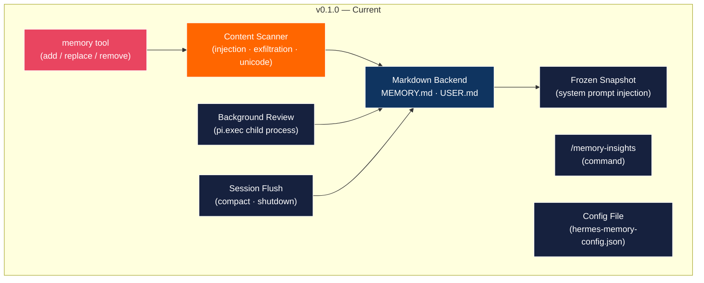
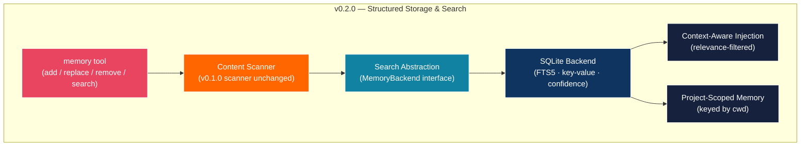
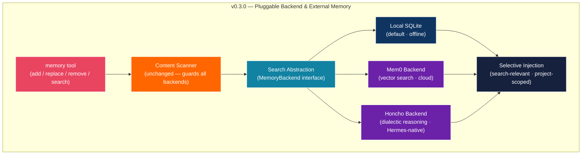
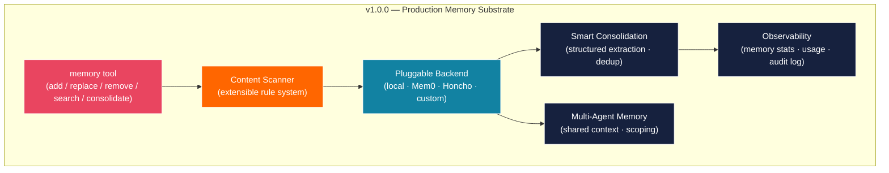
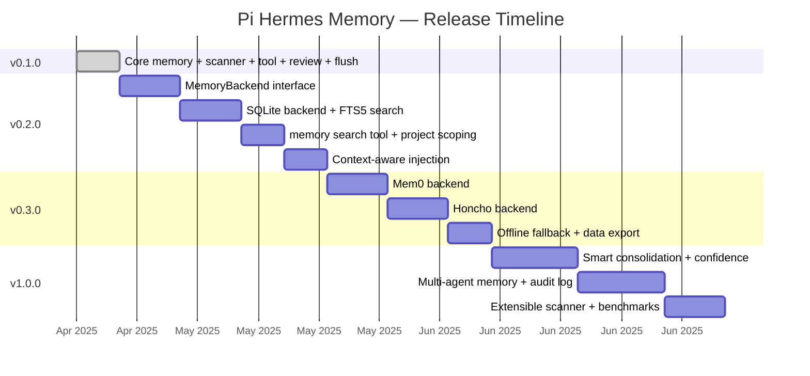

# Pi Hermes Memory — Roadmap

> From markdown files to a pluggable memory substrate for any Pi agent harness.

## Where We Are (v0.1.0)

- Persistent memory via `MEMORY.md` + `USER.md` with `§` delimiter
- Real-time `memory` tool (add / replace / remove) for the LLM
- Content scanning: prompt injection, role hijacking, secret exfiltration, invisible unicode
- Background learning loop (every N turns via `pi.exec`)
- Session flush before compaction and shutdown
- `/memory-insights` command
- Frozen snapshot injection into system prompt
- 119 automated tests, 0 type errors
- Atomic writes (temp + rename)

## Architecture Evolution









---

## v0.2.0 — Structured Storage & Search

**Goal**: Replace flat markdown with SQLite. Add search. Keep the same tool interface.

### `MemoryBackend` Interface

The core abstraction that makes everything after this possible:

```typescript
interface MemoryBackend {
  // Write
  add(target: "memory" | "user", entry: MemoryEntry): Promise<MemoryResult>;
  replace(target: "memory" | "user", query: string, entry: MemoryEntry): Promise<MemoryResult>;
  remove(target: "memory" | "user", query: string): Promise<MemoryResult>;

  // Read
  getAll(target: "memory" | "user"): Promise<MemoryEntry[]>;
  search(query: string, limit?: number): Promise<MemoryEntry[]>;

  // Lifecycle
  formatForSystemPrompt(cwd?: string, prompt?: string): Promise<string>;
  close(): Promise<void>;
}
```

Current `MemoryStore` becomes `MarkdownBackend` — the default, zero-dependency implementation. New `SQLiteBackend` adds structure without breaking anything.

### Deliverables

- [ ] `MemoryBackend` interface in `src/types.ts`
- [ ] `MarkdownBackend` — wraps current `MemoryStore` (backwards compatible)
- [ ] `SQLiteBackend` — FTS5 search, key-value entries, confidence scores, dedup by key
- [ ] `memory search` tool action — LLM can query existing entries
- [ ] Project-scoped memory — entries tagged with `cwd`, injected when matching
- [ ] Context-aware injection — `formatForSystemPrompt(cwd, prompt)` filters by relevance
- [ ] Config: `"backend": "markdown" | "sqlite"` (defaults to `markdown` for zero-dep install)
- [ ] Migration tool: `markdown → sqlite` one-time import

### What Does NOT Change

- Content scanner (guards all backends)
- Tool interface (`memory` tool name and actions)
- System prompt injection (frozen snapshot pattern)
- Config file location and format (just adds new fields)

---

## v0.3.0 — Pluggable External Memory

**Goal**: Let users swap the backend to Mem0 or Honcho without changing anything else. The content scanner guards all data before it leaves the machine.

### Why This Matters

External memory services provide better semantic search, cross-session continuity, and multi-agent awareness. But they introduce trust boundaries — your agent's memories leave your machine. The content scanner becomes the security gate between Pi and any external service.

### Deliverables

- [ ] `Mem0Backend` — wraps Mem0's Node.js SDK (`add`, `search`, `update`, `delete`)
- [ ] `HonchoBackend` — wraps Honcho's API (`honcho_context`, `honcho_search_conclusions`, `honcho_reasoning`)
- [ ] Backend auto-detection — check for `MEM0_API_KEY` or `HONCHO_API_KEY` env vars, offer to configure
- [ ] Config: `"backend": "sqlite" | "mem0" | "honcho"` with `"mem0": { "apiKey": "...", "orgId": "..." }` options
- [ ] Selective injection by default when using external backends (leverage their search APIs)
- [ ] Offline fallback — if external backend is unreachable, fall back to local SQLite cache
- [ ] Data export — `memory export` command to dump all entries as JSON

### Security Model

```
LLM tool call
    ↓
Content Scanner (local, always runs first)
    ↓ blocked? → return error to LLM
    ↓ passed
MemoryBackend.add()
    ↓
Mem0 / Honcho / SQLite / Markdown
```

The scanner runs **before** any backend. No adversarial content reaches external services.

---

## v1.0.0 — Production Memory Substrate

**Goal**: The memory layer that any Pi agent harness can build on top of.

### Deliverables

- [ ] Smart consolidation — structured extraction with typed output (preferences, patterns, corrections, tool prefs)
- [ ] Confidence scoring — entries gain confidence over time as they're referenced, decay if never used
- [ ] Multi-agent memory — shared context between agents, scoping rules (per-user, per-project, global)
- [ ] Extensible scanner rules — users can add custom patterns to the content scanner
- [ ] `/memory-insights` upgrade — show backend type, entry count, storage stats, last sync time
- [ ] Audit log — track all memory operations with timestamps (already in SQLite schema for `SQLiteBackend`)
- [ ] Import/export — migrate between backends without data loss
- [ ] Benchmarks — context injection latency, search relevance, token budget utilization

---

## Design Principles (Unchanging)

These hold across all versions:

1. **Security first** — Content scanning before any write, regardless of backend. No exceptions.
2. **Real-time saves** — The LLM can save memories mid-conversation via tool calls, not just at session end.
3. **Frozen snapshot** — Memory is injected into the system prompt once at session start. Never mutated mid-session.
4. **Crash safety** — Atomic writes for markdown, WAL mode for SQLite, graceful degradation for external backends.
5. **Zero-config start** — Install and it works with sensible defaults. Configuration is for power users.
6. **Backwards compatible** — Every new version is a drop-in upgrade. No breaking changes to the tool interface or config format without a major version bump.

---

## Version Timeline



---

## How to Contribute

See [TASKS.md](../TASKS.md) for current work. Pick an unchecked item, mark it `[~]`, implement, mark it `[x]` with the commit hash.

For roadmap items, open an issue with the version tag (e.g. `v0.2.0`) and describe what you want to work on.
